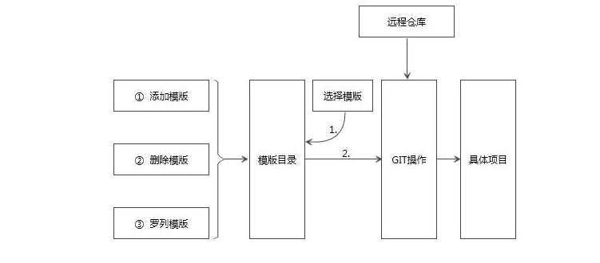
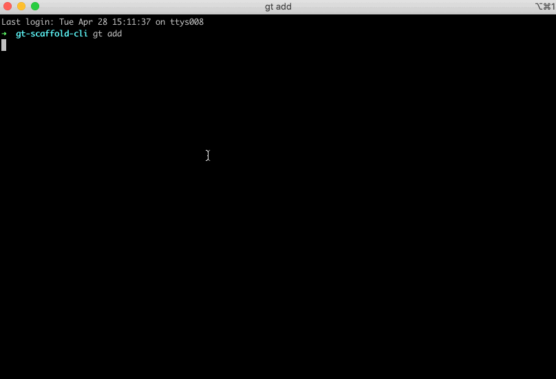
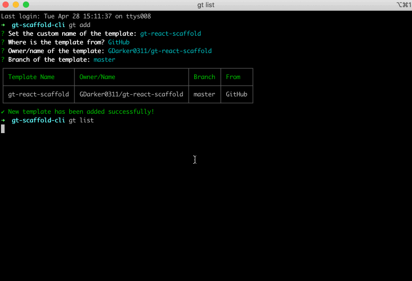
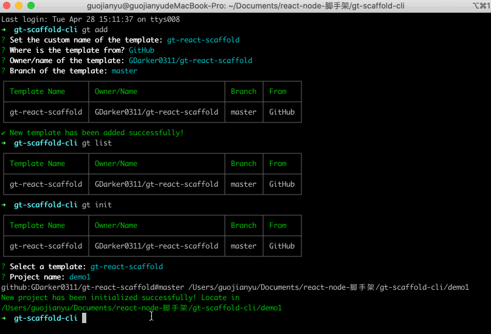
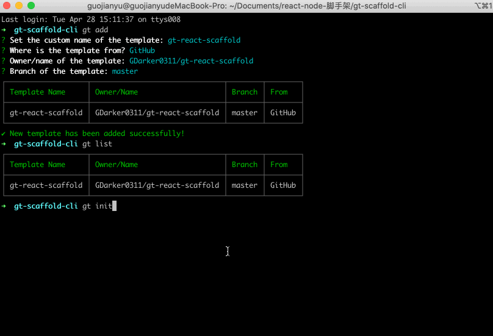

# gt


**gt** is a scaffold for initiating new projects from a given template.

## Template
A *template* is a sample folder with many files. You could place a template to GitHub, GitLab, Bitbucket or any other code repository, even in your local mechine!
## Directory Structure
```bash
├── .bin               # commander - 命令行解析
│   └── gt.js           # commander 启动文件
├── dist                # rollup打包后文件
│   ├── db                # db
│   └── index.js          # 打包后文件
├── node_modules        # node 依赖，需要加入 .gitignore
├── src                 # 源码目录
│   ├── commands            # 命令行解析-模版操作
│     ├── add.ts            # 增
│     ├── delete.ts         # 删
│     ├── init.ts           # 初始化
│     └── list.ts           # 列表
│   ├── db              # 数据库
│   ├── img             # 图标 GIF
│   ├── lib             # 工具类
│   └── commands.ts     # 导出 增加 列表 删除 初始化模块
├── .eslintignore.js    # eslint 忽略文件
├── .eslintrc.js        # editorconfig 配置文件
├── .gitignore          # git 忽略文件
├── .npmignore          # npn 忽略文件
├── doc-cli             # cli 相关技术文档
├── package-lock.json   # node 配置文件锁
├── package.json        # node 配置文件
├── README.md           # 说明文档
└── rollup.config.js    # rollup 打包配置文件

```
## Usage
Install **gt** globaly.
```bash
`npm install gt-scaffold-cli -g`

login:
`npm adduser`

publish
`npm publish --access public`
```

Check the `--help` command.
```bash
gt --help
```

```bash
Usage: gt <command>

Options:
  -V, --version  output the version number
  -h, --help     output usage information

Commands:
  add|a          Add a new template
  list|l         List all templates
  delete|d       Delete a template
  init|i         Generate a new project
```
architecture 
- Img
  
  

Just follow the FAQs and you will know how to use it.

- Add a template
  
  

- List all templates
  
  

- Delete a template
  
  

- Init a new project
  
  

## License
MIT

